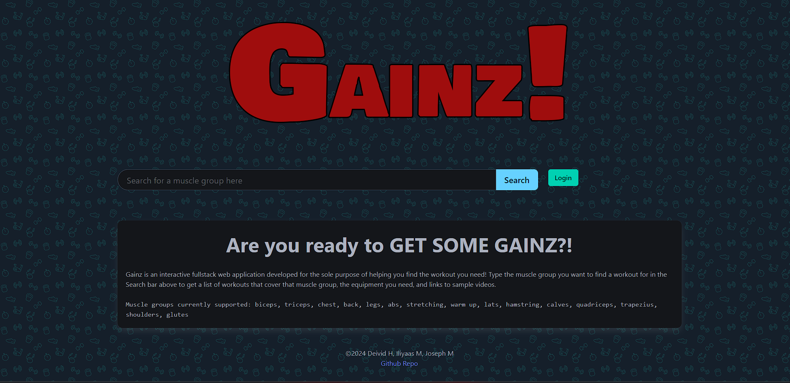

# Name of the Project

Gainz

## Description
Gainz is a fullstack website that revolves around finding workouts. There are many different options for what types of workouts you want. You can choose what muscle group you want to target and it will be able to load in various workouts that target that muscle.
## Acceptance Criteria

✅ Use Node.js and Express.js to create a RESTful API.

✅ Use Node.js and Express.js to create a RESTful API.

✅ Use PostgreSQL and the Sequelize ORM for the database.

✅ Have both GET and POST routes for retrieving and adding new data.

✅ Use at least one new library, package, or technology that we haven’t discussed.

✅ Have a folder structure that meets the MVC paradigm.

✅ Include authentication (express-session and cookies).

✅ Protect API keys and sensitive information with environment variables.

✅ Be deployed using Render (with data).

✅ Have a polished UI.

✅ Be responsive.

✅ Be interactive (i.e., accept and respond to user input).

✅ Meet good-quality coding standards (file structure, naming conventions, follows best practices for class/id naming conventions, indentation, quality comments, etc.).

✅Have a professional README (with unique name, description, technologies used, screenshot, and link to deployed application).

## License

MIT License - The License file is provided here : (./LICENSE)

## Screenshot

## Deployed Page and GitHub Repository

Deployed Webpage : 

Github Repository: https://github.com/jdmonticelli/Gainz

## Credit Where Credit Is Due

Deivid H. worked on ReadMe, presentation and bug fixing.

Joseph M. worked on layout and structuring of the website. Also Worked on javascript and helped with bug fixes with the Api and Sql authentication.

Iliyaas M. worked on api and getting it implemented on the website.

